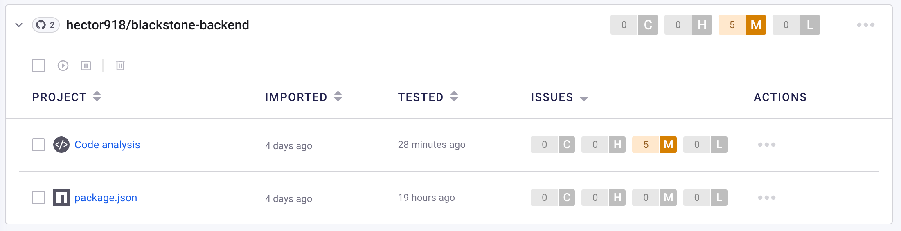

# Meeting Room Booking Web App

## Tech Stack

- Node.js
- Express
- React
- Postgresql
- Bulma
- Auth0
- Oracle Cloud
- Cloudflare
- Snyk

## Highlights

1. **User Authentication:** Utilize Auth0 for user authorization, allowing users to log in using Google, Apple, Microsoft, and GitHub accounts.
2. **Security:** All user inputs are validated and filtered, providing a high level of security.
3. **Logging and Performance Monitoring:** Includes error logging and request logging to files, along with performance timers, making debugging and optimization easier. It can also automatically clean outdated log files.
4. **Responsive Design:** The user interface can automatically adapt to both mobile and desktop environments.

## Deployment Guide

1. Register an Auth0 account.
2. Deploy `/db/schema.txt` to a PostgreSQL server.
3. Clone the backend repo to the VPS.
4. Create a `.env` file with the following format:

```
   HTTPS_PORT=
   HTTP_PORT=
   PG_HOST=
   PG_PORT=
   PG_DB=
   PG_USER=
   PG_PASSWORD=
   SINGLE_USER_MODE=false
   AUTH_SECRET=
   AUTH0_BASEURL=
   AUTH0_CLIENTID=
   AUTH0_ISSUERBASEURL=
```

5. Update the HTTPS certificate and key under `\ssl`.
6. Run `npm i`.
7. Start the server using `npm run server` or `node server.js`.

### Synk application Security check result



### API

Create a RESTFul API service with the below endpoints that read and write to the database. It should accept and return JSON payloads.

| Method   | Endpoint                          | Description                                                                                                                                   | Example JSON Body Payload                                                                                                                                                                                                                                                                                                          |
| -------- | --------------------------------- | --------------------------------------------------------------------------------------------------------------------------------------------- | ---------------------------------------------------------------------------------------------------------------------------------------------------------------------------------------------------------------------------------------------------------------------------------------------------------------------------------- |
| `GET`    | `/api/meeting-rooms`              | List all meeting rooms                                                                                                                        | n/a                                                                                                                                                                                                                                                                                                                                |
| `POST`   | `/api/meeting-rooms`              | Create a meeting room<br><em>All fields are required</em>                                                                                     | { <br>&nbsp;&nbsp;&nbsp;&nbsp;"name": "Meeting Room 1",<br>&nbsp;&nbsp;&nbsp;&nbsp;"capacity": 3,<br>&nbsp;&nbsp;&nbsp;&nbsp;"floor": 22<br>}                                                                                                                                                                                      |
| `GET`    | `/api/meeting-rooms/:id`          | Retrieve a meeting room by id                                                                                                                 | n/a                                                                                                                                                                                                                                                                                                                                |
| `GET`    | `/api/meeting-rooms/:id/bookings` | Retrieve all **future** bookings of a meeting room                                                                                            | n/a                                                                                                                                                                                                                                                                                                                                |
| `GET`    | `/api/bookings`                   | List all **future** bookings                                                                                                                  | n/a                                                                                                                                                                                                                                                                                                                                |
| `GET`    | `/api/bookings/:id`               | Retrieve a booking by id                                                                                                                      | n/a                                                                                                                                                                                                                                                                                                                                |
| `POST`   | `/api/bookings`                   | Create a booking for a meeting room<br><em>All fields are required except attendees</em><br><em>Validates that room is available to book</em> | { <br>&nbsp;&nbsp;&nbsp;&nbsp;"meetingName": "Scrum Standup",<br>&nbsp;&nbsp;&nbsp;&nbsp;"meetinRoomId": 2,<br>&nbsp;&nbsp;&nbsp;&nbsp;"startDate": "2022-03-23T17:00:00.000Z",<br>&nbsp;&nbsp;&nbsp;&nbsp;"endDate": "2022-03-23T17:30:00.000Z",<br>&nbsp;&nbsp;&nbsp;&nbsp;"attendees": "jdoe@email.com, bdylan@email.com"<br> } |
| `DELETE` | `/api/bookings/:id`               | Cancel a booking by id                                                                                                                        | n/a                                                                                                                                                                                                                                                                                                                                |
| `POST`   | `/api/meeting-rooms/available`    | **Extra challenge:** <br>Retrieve available rooms by search criteria<br><em>startDate and endDate are required</em>                           | { <br>&nbsp;&nbsp;&nbsp;&nbsp;"startDate": "2022-03-23T17:00:00.000Z",<br>&nbsp;&nbsp;&nbsp;&nbsp;"endDate": "2022-03-23T17:30:00.000Z",<br>&nbsp;&nbsp;&nbsp;&nbsp;"floor": 22,<br>&nbsp;&nbsp;&nbsp;&nbsp;"capacity": 3<br> }                                                                                                    |

### App Pages/Views

Your Room Booking App should have the following pages (and be displayed at their respective browser url).

#### Home `/`

Displays a nav bar or navigation menu that would take the user to **Meeting Rooms**, **Bookings** and **New Room** pages. This navbar should be visible on all pages/views.

Below the navbar display a list of all meeting rooms.

When you click in one of the meeting rooms of the list it should take the user to the meeting room page.

**Extra challenge:** Above list, display a form to look for available rooms. The form must include Start Date, End Date, Floor and Capacity input fields and a Find button. The Floor and Capacity inputs should be optional and all others required. The result should filter list of meeting rooms to display only the available ones.

#### Single Meeting Room `/meetingrooms/:id`

Displays the details of the meeting room and below it all its **future** bookings.

Display a form to book the meeting room. The form must include Meeting Name, Start Date, End Date and Attendees input fields and a Submit button. The Attendees input should be optional and all others required. Show a success message upon successful booking creation and an error message otherwise.

Should also display a list of all existing **future** bookings and when you click in one of the bookings of the list it should take the user to that booking's page/view.

#### New Meeting Room `/meetingrooms/new`

Display a form where a user (admin) can create a meeting room. The form must include Name, Capacity and Floor input fields and Submit button. All inputs are required. Show a success message upon successful meeting room creation and an error message otherwise.

#### Bookings `/bookings`

Displays a list of all **future** bookings for all meeting rooms and when you click in one of the bookings of the list it should take the user to that booking's page/view.

#### Single Booking `/bookings/:id`

Displays the details of the booking and a button to cancel it. Clicking Cancel should prompt user to confirm that they want to cancel booking. If they choose Yes it should cancel booking and if they choose No it should do nothing. Show a success message upon successful booking cancelation and an error message otherwise.
