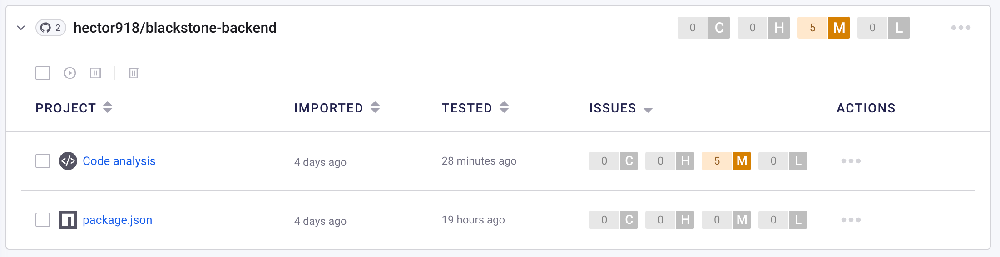

# Meeting Room Booking Web App

## Tech Stack

- Node.js
- Express
- React
- Postgresql
- Bulma
- Auth0
- Oracle Cloud
- Cloudflare
- Snyk

## Highlights

1. **User Authentication:** Utilize Auth0 for user authorization, allowing users to log in using Google, Apple, Microsoft, and GitHub accounts.
2. **Security:** All user inputs are validated and filtered, providing a high level of security.
3. **Logging and Performance Monitoring:** Includes error logging and request logging to files, along with performance timers, making debugging and optimization easier. It can also automatically clean outdated log files.
4. **Responsive Design:** The user interface can automatically adapt to both mobile and desktop environments.

### Synk application Security check result



## Deployment Guide

1. Register an Auth0 account.
2. Deploy `/db/schema.txt` to a PostgreSQL server.
3. Clone the backend repo to the VPS.
4. Create a `.env` file with the following format:

```
   HTTPS_PORT=
   HTTP_PORT=
   PG_HOST=
   PG_PORT=
   PG_DB=
   PG_USER=
   PG_PASSWORD=
   SINGLE_USER_MODE=false
   AUTH_SECRET=
   AUTH0_BASEURL=
   AUTH0_CLIENTID=
   AUTH0_ISSUERBASEURL=
```

5. Update the HTTPS certificate and key under `\ssl`.
6. Run `npm i`.
7. Start the server using `npm run server` or `node server.js`.

### Repository

- Backend repo [https://github.com/hector918/blackstone-backend](https://github.com/hector918/blackstone-backend).
- Frontend repo [https://github.com/hector918/meeting-booking](https://github.com/hector918/meeting-booking).

### API

Create a RESTFul API service with the below endpoints that read and write to the database. It should accept and return JSON payloads.

| Method   | Endpoint                          | Description                                                                                                                                   | Example JSON Body Payload                                                                                                                                                                                                                                                                                                          |
| -------- | --------------------------------- | --------------------------------------------------------------------------------------------------------------------------------------------- | ---------------------------------------------------------------------------------------------------------------------------------------------------------------------------------------------------------------------------------------------------------------------------------------------------------------------------------- |
| `GET`    | `/api/meeting-rooms`              | List all meeting rooms                                                                                                                        | n/a                                                                                                                                                                                                                                                                                                                                |
| `POST`   | `/api/meeting-rooms`              | Create a meeting room<br><em>All fields are required</em>                                                                                     | { <br>&nbsp;&nbsp;&nbsp;&nbsp;"name": "Meeting Room 1",<br>&nbsp;&nbsp;&nbsp;&nbsp;"capacity": 3,<br>&nbsp;&nbsp;&nbsp;&nbsp;"floor": 22<br>}                                                                                                                                                                                      |
| `GET`    | `/api/meeting-rooms/:id`          | Retrieve a meeting room by id                                                                                                                 | n/a                                                                                                                                                                                                                                                                                                                                |
| `GET`    | `/api/meeting-rooms/:id/bookings` | Retrieve all **future** bookings of a meeting room                                                                                            | n/a                                                                                                                                                                                                                                                                                                                                |
| `GET`    | `/api/bookings`                   | List all **future** bookings                                                                                                                  | n/a                                                                                                                                                                                                                                                                                                                                |
| `GET`    | `/api/bookings/:id`               | Retrieve a booking by id                                                                                                                      | n/a                                                                                                                                                                                                                                                                                                                                |
| `POST`   | `/api/bookings`                   | Create a booking for a meeting room<br><em>All fields are required except attendees</em><br><em>Validates that room is available to book</em> | { <br>&nbsp;&nbsp;&nbsp;&nbsp;"meetingName": "Scrum Standup",<br>&nbsp;&nbsp;&nbsp;&nbsp;"meetinRoomId": 2,<br>&nbsp;&nbsp;&nbsp;&nbsp;"startDate": "2022-03-23T17:00:00.000Z",<br>&nbsp;&nbsp;&nbsp;&nbsp;"endDate": "2022-03-23T17:30:00.000Z",<br>&nbsp;&nbsp;&nbsp;&nbsp;"attendees": "jdoe@email.com, bdylan@email.com"<br> } |
| `DELETE` | `/api/bookings/:id`               | Cancel a booking by id                                                                                                                        | n/a                                                                                                                                                                                                                                                                                                                                |
| `POST`   | `/api/meeting-rooms/available`    | **Extra challenge:** <br>Retrieve available rooms by search criteria<br><em>startDate and endDate are required</em>                           | { <br>&nbsp;&nbsp;&nbsp;&nbsp;"startDate": "2022-03-23T17:00:00.000Z",<br>&nbsp;&nbsp;&nbsp;&nbsp;"endDate": "2022-03-23T17:30:00.000Z",<br>&nbsp;&nbsp;&nbsp;&nbsp;"floor": 22,<br>&nbsp;&nbsp;&nbsp;&nbsp;"capacity": 3<br> }                                                                                                    |
